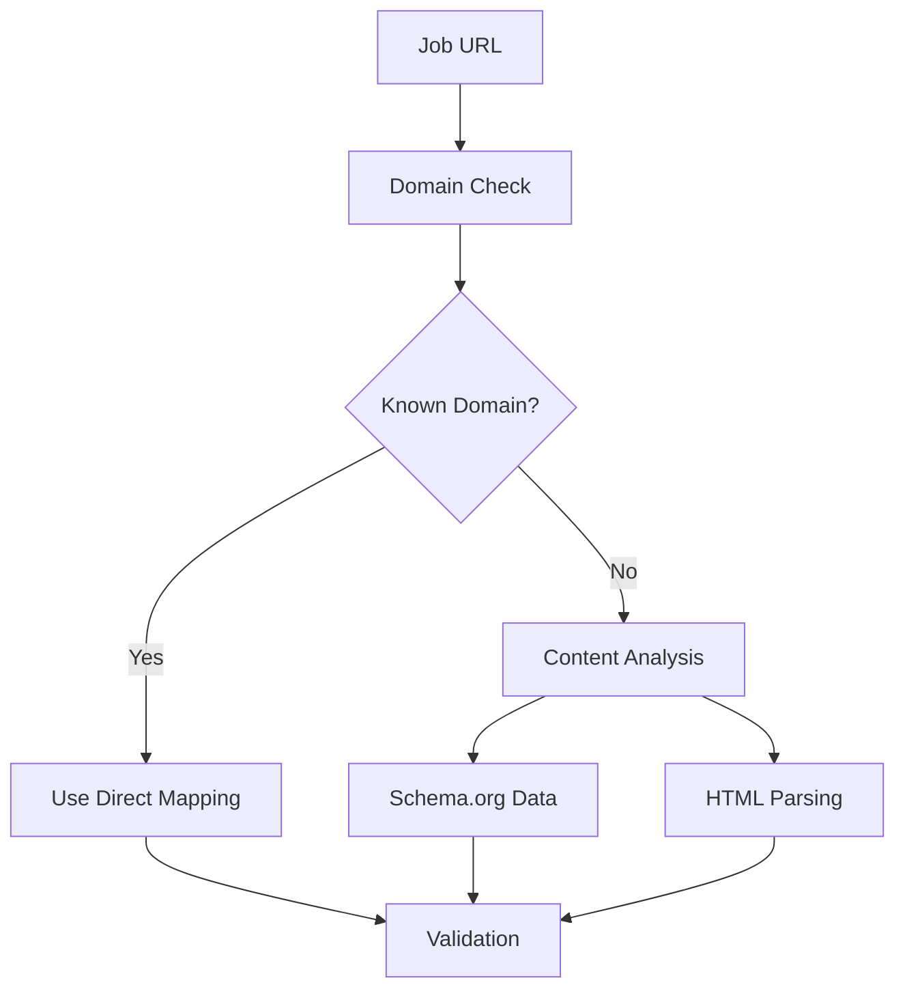

# Job Analysis Technical Documentation

## Overview

The job analyzer is critical for:
- Extracting accurate job details
- Company name identification
- Requirement parsing
- Experience matching

## Known Issues

### Company Name Extraction
```typescript
// Current implementation limitation
if (urlLower.includes('linkedin.com')) return JobSite.LINKEDIN;
// Doesn't handle domain-specific company names properly
```

### Required Fix
```typescript
const domainCompanyMap = {
  'nm.org': 'Northwestern Medicine',
  'illinois.gov': 'State of Illinois'
  // Add more mappings as encountered
};

function determineCompanyName(url: string, content: string): string {
  // Check domain mappings first
  for (const [domain, company] of Object.entries(domainCompanyMap)) {
    if (url.includes(domain)) return company;
  }
  // Fall back to content analysis
}
```

## Best Practices

1. **URL Analysis**
   - Check domain-specific mappings first
   - Fall back to content parsing
   - Verify against known patterns

2. **Content Extraction**
   - Use structured data when available (e.g., schema.org)
   - Fall back to HTML parsing
   - Validate against expected patterns

3. **Requirements Parsing**
   - Identify clear markers (Required:, Preferred:)
   - Extract bullet points
   - Map to source data structure

## Integration Points



## Verification Steps

1. **Company Information**
   ```typescript
   interface CompanyInfo {
     name: string;
     verified: boolean;
     source: 'domain' | 'schema' | 'content';
     confidence: number;
   }
   ```

2. **Requirements Validation**
   ```typescript
   interface RequirementMatch {
     requirement: string;
     sourceData: VerifiedClaim[];
     confidence: number;
   }
   ```

## Future Improvements

1. **Domain Recognition**
   - Expand domain-company mappings
   - Add fuzzy matching for company names
   - Implement confidence scoring

2. **Content Analysis**
   - Improve HTML structure recognition
   - Add support for PDF job descriptions
   - Enhance requirement categorization

3. **Integration**
   - Add logging for analysis decisions
   - Implement feedback loop for improvements
   - Create company name override capability
