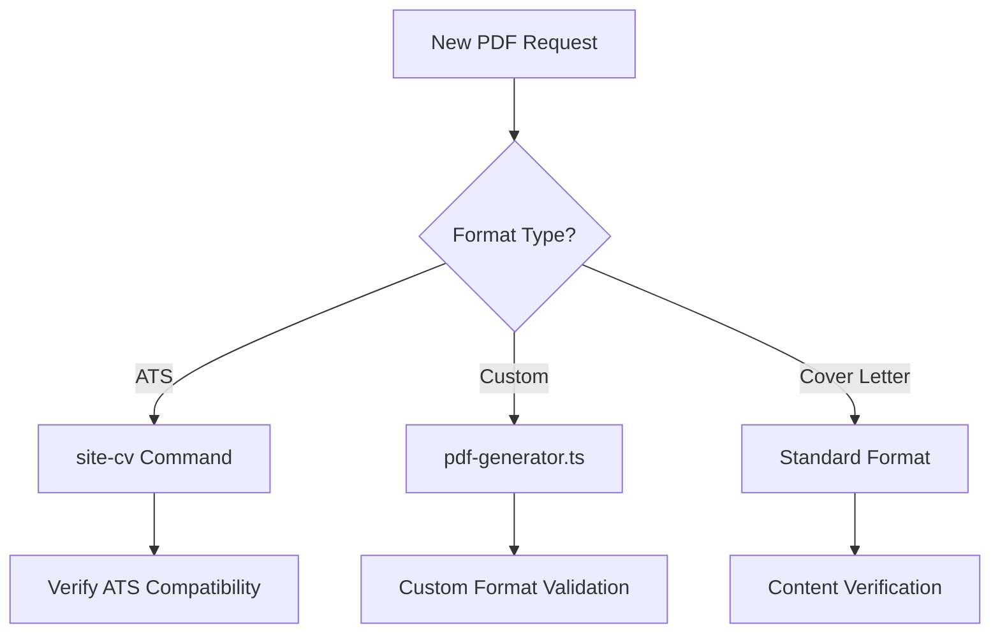

# PDF Generation Technical Documentation

## Implementation Hierarchy

1. **Core Implementation** (`src/utils/pdf-generator.ts`)
   - Base PDF generation functionality
   - Puppeteer integration
   - Style management

2. **CLI Wrapper** (`cli/commands/site-cv.ts`)
   - ATS-friendly formatting
   - Command-line interface
   - Standard templates

3. **Custom Generators** (`utils/generate-*.js`)
   - Special format requirements
   - Custom styling
   - Specific use cases

## Decision Flow



## Usage Examples

### ATS-Friendly Generation
```typescript
// Always use for job applications unless specifically required otherwise
const result = await generateATSFriendly({
  content: verifiedContent,
  template: 'standard',
  output: 'output/job-name/cv.pdf'
});
```

### Custom Format Generation
```typescript
// Use only when standard format won't meet requirements
const result = await generateCustomFormat({
  content: verifiedContent,
  template: customTemplate,
  styling: customStyling,
  output: 'output/job-name/cv-custom.pdf'
});
```
