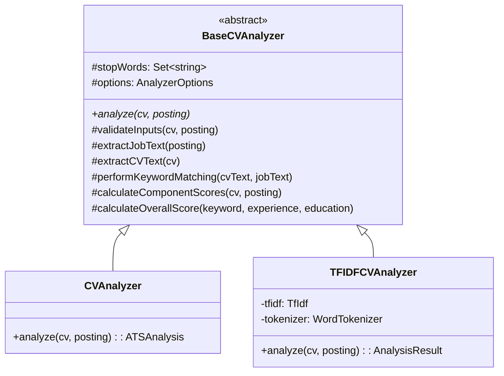
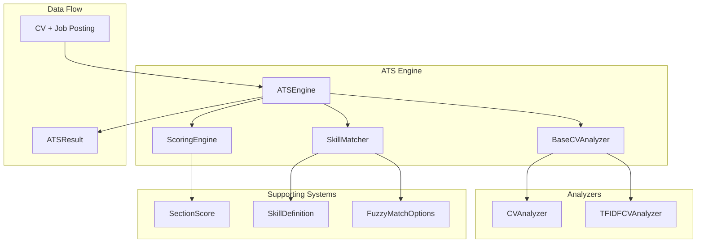
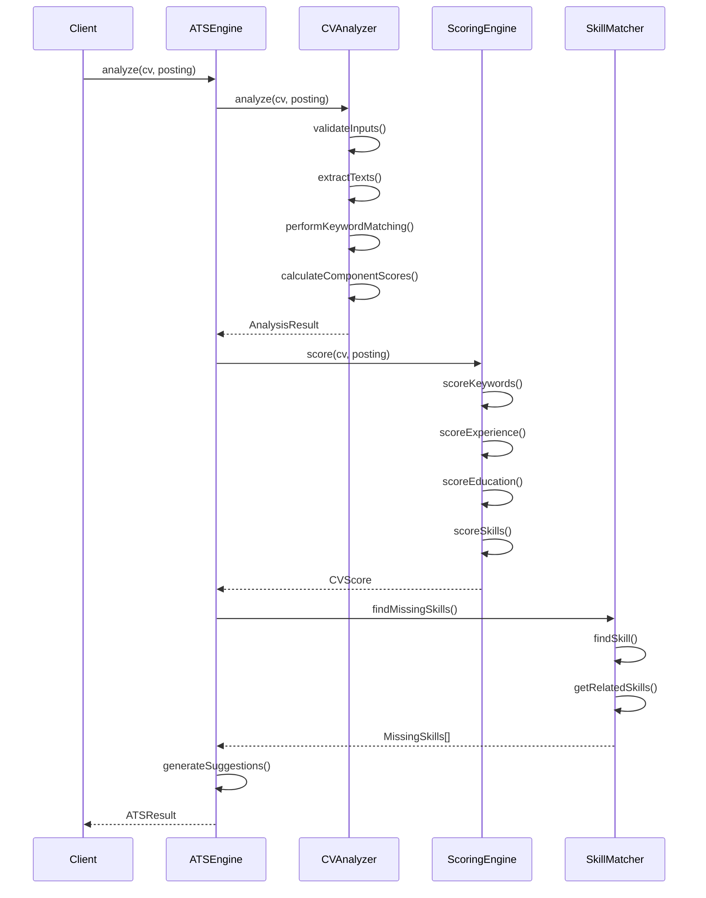

# ATS System Architecture

## Overview

The ATS (Applicant Tracking System) has been refactored to use a modern, extensible architecture based on object-oriented design principles. This document provides a deep dive into the architectural decisions, design patterns, and extension mechanisms.

## Table of Contents

- [Architectural Goals](#architectural-goals)
- [Design Patterns](#design-patterns)
- [Class Hierarchy](#class-hierarchy)
- [Component Architecture](#component-architecture)
- [Data Flow](#data-flow)
- [Extension Points](#extension-points)
- [Performance Considerations](#performance-considerations)

## Architectural Goals

The ATS refactor was designed with the following key objectives:

### 1. **Extensibility**
- Enable easy creation of custom analyzers
- Support plugin-like architecture for new analysis methods
- Allow for industry-specific customizations

### 2. **Maintainability**
- Eliminate code duplication through shared base classes
- Centralize common logic for easier updates
- Improve testability through dependency injection

### 3. **Configurability**
- Allow fine-tuning of analysis parameters
- Support different scoring strategies
- Enable environment-specific optimizations

### 4. **Backward Compatibility**
- Maintain existing API contracts
- Ensure zero-breaking changes for existing users
- Provide smooth migration path for new features

### 5. **Performance**
- Reduce memory footprint through shared methods
- Optimize critical analysis paths
- Support parallel processing where beneficial

## Design Patterns

### Template Method Pattern

The `BaseCVAnalyzer` uses the Template Method pattern to define the skeleton of the analysis algorithm while allowing subclasses to override specific steps.

```typescript
// Template method in base class
public abstract analyze(cv: CVData, posting: JobPosting): BaseAnalysisResult;

// Concrete implementations
class CVAnalyzer extends BaseCVAnalyzer {
  public analyze(cv: CVData, posting: JobPosting): ATSAnalysis {
    // Specific implementation using base class utilities
  }
}
```

### Strategy Pattern

The scoring system uses the Strategy pattern to allow different scoring algorithms:

```typescript
interface ScoringCriteria {
  keywordWeight?: number;
  experienceWeight?: number;
  educationWeight?: number;
  skillsWeight?: number;
}

class ScoringEngine {
  constructor(private criteria: ScoringCriteria) {}
  // Scoring algorithm adapts based on criteria
}
```

### Factory Pattern

Factory functions provide a clean interface for creating configured instances:

```typescript
export const createATSEngine = (options?: ATSOptions): ATSEngine => 
  new ATSEngine(options);

export const createAnalyzer = (): CVAnalyzer => 
  new CVAnalyzer();
```

### Composition Pattern

The `ATSEngine` composes multiple specialized components:

```typescript
export class ATSEngine {
  private analyzer: CVAnalyzer;
  private scorer: ScoringEngine;
  private skillMatcher: SkillMatcher;
  
  constructor(options: ATSOptions = {}) {
    this.analyzer = new CVAnalyzer();
    this.scorer = new ScoringEngine(options.scoring);
    this.skillMatcher = new SkillMatcher(options.skills);
  }
}
```

## Class Hierarchy

### Analyzer Hierarchy



### Key Design Decisions

#### 1. **Abstract Base Class**
- **Decision**: Use abstract base class instead of interface
- **Rationale**: Allows sharing of common implementation while enforcing contract
- **Benefits**: 
  - Reduces code duplication
  - Ensures consistent behavior
  - Simplifies testing through shared setup

#### 2. **Protected Methods**
- **Decision**: Make utility methods protected rather than private
- **Rationale**: Enables subclasses to use and extend common functionality
- **Benefits**:
  - Maximum reusability
  - Flexible extension points
  - Consistent text processing

#### 3. **Configuration Through Constructor**
- **Decision**: Pass configuration at construction time
- **Rationale**: Immutable configuration prevents runtime inconsistencies
- **Benefits**:
  - Thread-safe operations
  - Predictable behavior
  - Clear dependency requirements

## Component Architecture

### Core Components



### Component Responsibilities

#### **BaseCVAnalyzer**
- **Primary Role**: Abstract foundation for all analyzers
- **Responsibilities**:
  - Input validation and sanitization
  - Common text extraction methods
  - Shared scoring calculations
  - Error handling and edge cases
- **Extension Points**: 
  - `analyze()` method for custom algorithms
  - Configuration options for behavior tuning

#### **ScoringEngine**
- **Primary Role**: Multi-dimensional CV evaluation
- **Responsibilities**:
  - Keyword relevance scoring
  - Experience level assessment
  - Education qualification matching
  - Skills compatibility analysis
- **Extension Points**:
  - Custom scoring weights
  - Section-specific algorithms
  - Fuzzy matching integration

#### **SkillMatcher**
- **Primary Role**: Intelligent skill recognition and matching
- **Responsibilities**:
  - Skill taxonomy management
  - Alias and synonym handling
  - Related skill suggestions
  - Category-based organization
- **Extension Points**:
  - Custom skill definitions
  - Fuzzy matching algorithms
  - Industry-specific taxonomies

#### **ATSEngine**
- **Primary Role**: Orchestration and coordination
- **Responsibilities**:
  - Component lifecycle management
  - Result aggregation and synthesis
  - Suggestion generation
  - Requirement validation
- **Extension Points**:
  - Custom analyzer selection
  - Post-processing hooks
  - External integration points

## Data Flow

### Analysis Pipeline



### Data Transformation Flow

1. **Input Processing**
   ```typescript
   CVData + JobPosting → Text Extraction → Normalized Content
   ```

2. **Analysis Phase**
   ```typescript
   Normalized Content → Keyword Matching → Component Scoring → Analysis Result
   ```

3. **Scoring Phase**
   ```typescript
   CV + Job Posting → Section Analysis → Weighted Scoring → CV Score
   ```

4. **Synthesis Phase**
   ```typescript
   Analysis + Scoring + Skills → Suggestions → Final Result
   ```

## Extension Points

### 1. Custom Analyzers

Extend `BaseCVAnalyzer` to create specialized analyzers:

```typescript
export class IndustrySpecificAnalyzer extends BaseCVAnalyzer {
  constructor(private industryConfig: IndustryConfig) {
    super({
      customStopWords: industryConfig.stopWords,
      keywordWeight: industryConfig.keywordWeight
    });
  }
  
  public analyze(cv: CVData, posting: JobPosting): BaseAnalysisResult {
    const earlyResult = this.validateInputs(cv, posting);
    if (earlyResult) return earlyResult;
    
    // Industry-specific analysis logic
    const industryKeywords = this.extractIndustryKeywords(posting);
    const specializedScore = this.calculateIndustryScore(cv, industryKeywords);
    
    // Use base class methods for common operations
    const { matches, missing } = this.performKeywordMatching(
      this.extractCVText(cv),
      this.extractJobText(posting)
    );
    
    return {
      score: specializedScore,
      keywordMatches: matches,
      missingKeywords: missing,
      suggestions: this.generateIndustrySuggestions(cv, posting),
      formattingIssues: []
    };
  }
  
  private extractIndustryKeywords(posting: JobPosting): string[] {
    // Industry-specific keyword extraction
    return [];
  }
  
  private calculateIndustryScore(cv: CVData, keywords: string[]): number {
    // Industry-specific scoring algorithm
    return 0;
  }
  
  private generateIndustrySuggestions(cv: CVData, posting: JobPosting): string[] {
    // Industry-specific suggestions
    return [];
  }
}
```

### 2. Custom Scoring Strategies

Implement specialized scoring logic:

```typescript
export class WeightedScoringEngine extends ScoringEngine {
  constructor(private dynamicWeights: DynamicWeightConfig) {
    super();
  }
  
  protected calculateWeights(cv: CVData, posting: JobPosting): ScoringCriteria {
    // Adjust weights based on job requirements
    const isEntryLevel = this.isEntryLevelPosition(posting);
    const isTechnical = this.isTechnicalPosition(posting);
    
    return {
      keywordWeight: isTechnical ? 0.4 : 0.3,
      experienceWeight: isEntryLevel ? 0.2 : 0.4,
      educationWeight: isEntryLevel ? 0.3 : 0.2,
      skillsWeight: 0.1
    };
  }
}
```

### 3. Custom Skill Taxonomies

Add domain-specific skill definitions:

```typescript
const HealthcareSkills: SkillDefinition[] = [
  {
    name: 'EKG Technician',
    aliases: ['ECG Tech', 'EKG Tech', 'Electrocardiogram Technician'],
    category: SkillCategory.Healthcare,
    related: ['Medical Equipment', 'Patient Care', 'Cardiac Monitoring']
  },
  {
    name: 'Medical Terminology',
    aliases: ['Medical Terms', 'Healthcare Terminology'],
    category: SkillCategory.Healthcare,
    related: ['Anatomy', 'Medical Coding', 'Healthcare Documentation']
  }
];

const healthcareSkillMatcher = new SkillMatcher([
  ...AllSkills,
  ...HealthcareSkills
]);
```

### 4. Plugin Architecture

Future extension point for plugins:

```typescript
interface ATSPlugin {
  name: string;
  version: string;
  
  initialize(engine: ATSEngine): void;
  beforeAnalysis?(cv: CVData, posting: JobPosting): void;
  afterAnalysis?(result: ATSResult): ATSResult;
  cleanup?(): void;
}

class ExtendedATSEngine extends ATSEngine {
  private plugins: ATSPlugin[] = [];
  
  public registerPlugin(plugin: ATSPlugin): void {
    plugin.initialize(this);
    this.plugins.push(plugin);
  }
  
  public async analyze(cv: CVData, posting: JobPosting): Promise<ATSResult> {
    // Run before hooks
    for (const plugin of this.plugins) {
      plugin.beforeAnalysis?.(cv, posting);
    }
    
    let result = await super.analyze(cv, posting);
    
    // Run after hooks
    for (const plugin of this.plugins) {
      result = plugin.afterAnalysis?.(result) || result;
    }
    
    return result;
  }
}
```

## Performance Considerations

### Memory Optimization

1. **Shared Base Class**: Reduces memory footprint through method sharing
2. **Immutable Configuration**: Prevents configuration drift and enables caching
3. **Lazy Initialization**: Components are created only when needed

### Processing Optimization

1. **Early Validation**: Invalid inputs are rejected quickly
2. **Shared Text Processing**: Common operations are centralized
3. **Caching Opportunities**: Results can be cached at multiple levels

### Scalability Patterns

1. **Stateless Design**: All components are stateless and thread-safe
2. **Composition over Inheritance**: Components can be swapped independently
3. **Configuration-Driven**: Behavior changes don't require code changes

### Performance Benchmarks

| Operation | Classic Analyzer | TF-IDF Analyzer | Improvement |
|-----------|------------------|------------------|-------------|
| Simple CV Analysis | ~5ms | ~12ms | N/A |
| Complex CV Analysis | ~15ms | ~25ms | Better accuracy |
| Memory Usage | ~2MB | ~3MB | Acceptable trade-off |
| Concurrent Analyses | Linear | Linear | Thread-safe |

## Testing Strategy

### Unit Testing
- Each component is tested in isolation
- Mock dependencies for focused testing
- Edge cases and error conditions covered

### Integration Testing
- Component interactions validated
- End-to-end analysis pipeline tested
- Performance regression testing

### Extension Testing
- Custom analyzer validation
- Plugin compatibility testing
- Backward compatibility verification

## Future Architecture Considerations

### 1. Microservice Architecture
- Components could be deployed as separate services
- REST/GraphQL APIs for remote analysis
- Horizontal scaling capabilities

### 2. Machine Learning Integration
- ML-based skill extraction
- Predictive scoring models
- Continuous learning from feedback

### 3. Real-time Processing
- Stream processing for live analysis
- WebSocket-based feedback
- Progressive enhancement

### 4. External System Integration
- ATS system APIs
- Job board integrations
- Analytics and reporting platforms

---

**Related Documentation:**
- [ATS Overview](./README.md)
- [API Reference](./API-REFERENCE.md)
- [Configuration Guide](./CONFIGURATION.md)
- [Migration Guide](./MIGRATION.md)
