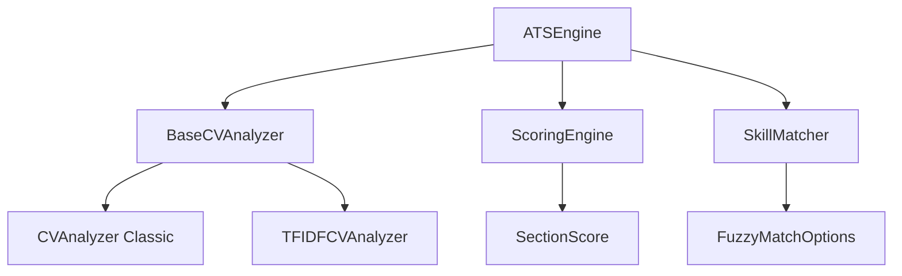

# ATS (Applicant Tracking System) Technical Documentation

## Overview

The ATS system provides comprehensive CV analysis capabilities, including keyword matching, skill assessment, and compatibility scoring against job postings. The system has been refactored to use a modern, extensible architecture with enhanced configurability.

## Table of Contents

- [Architecture Overview](#architecture-overview)
- [Core Components](#core-components)
- [Configuration](#configuration)
- [Usage Examples](#usage-examples)
- [Extension Points](#extension-points)
- [API Reference](#api-reference)

## Architecture Overview

The ATS system is built around a unified architecture with the following key components:



### Key Design Principles

1. **Extensibility**: Abstract base class allows for custom analyzer implementations
2. **Configurability**: All components accept configuration options for customization
3. **Backward Compatibility**: Existing APIs remain unchanged
4. **Performance**: Shared logic reduces duplication and improves efficiency
5. **Type Safety**: Comprehensive TypeScript interfaces ensure reliability

## Core Components

### 1. BaseCVAnalyzer (Abstract Base Class)

The foundation of all CV analyzers, providing shared functionality:

```typescript
export abstract class BaseCVAnalyzer {
  protected readonly stopWords: Set<string>;
  protected readonly options: Required<AnalyzerOptions>;
  
  public abstract analyze(cv: CVData, posting: JobPosting): BaseAnalysisResult;
  protected validateInputs(cv: CVData, posting: JobPosting): BaseAnalysisResult | null;
  protected performKeywordMatching(cvText: string, jobText: string): { matches: string[]; missing: string[] };
  protected calculateComponentScores(cv: CVData, posting: JobPosting): { experienceScore: number; educationScore: number };
}
```

**Features:**
- Input validation and error handling
- Shared text extraction methods
- Common scoring calculations
- Configurable stop words and options

### 2. Analyzer Implementations

#### CVAnalyzer (Classic)
- Traditional keyword-based analysis
- Simple scoring algorithm
- Fast performance
- Suitable for most use cases

#### TFIDFCVAnalyzer
- Advanced TF-IDF-based analysis
- Natural language processing
- Enhanced keyword weighting
- Better accuracy for complex documents

### 3. Enhanced Scoring Engine

```typescript
export class ScoringEngine {
  constructor(criteria?: ScoringCriteria) { }
  
  public score(cv: CVData, posting: JobPosting): CVScore;
  private scoreKeywords(cv: CVData, posting: JobPosting): SectionScore;
  private scoreExperience(cv: CVData, posting: JobPosting): SectionScore;
  private scoreEducation(cv: CVData, posting: JobPosting): SectionScore;
  private scoreSkills(cv: CVData, posting: JobPosting): SectionScore;
}
```

**Features:**
- Customizable scoring weights
- Section-by-section analysis
- Detailed suggestions and feedback
- Fuzzy matching support (planned)

### 4. Skill Matching System

```typescript
export class SkillMatcher {
  constructor(skills?: SkillDefinition[], fuzzyOptions?: FuzzyMatchOptions) { }
  
  public findSkill(name: string): SkillDefinition | undefined;
  public getRelatedSkills(name: string): SkillDefinition[];
  public areRelated(skill1: string, skill2: string): boolean;
}
```

**Features:**
- Comprehensive skill taxonomy
- Alias and related skill support
- Fuzzy matching capabilities
- Extensible skill definitions

## Configuration

### AnalyzerOptions

```typescript
interface AnalyzerOptions {
  keywordWeight?: number;      // Default: 0.5
  experienceWeight?: number;   // Default: 0.3
  educationWeight?: number;    // Default: 0.2
  enableTfIdf?: boolean;       // Default: false
  customStopWords?: string[];  // Default: []
}
```

### ScoringCriteria

```typescript
interface ScoringCriteria {
  keywordWeight?: number;      // Default: 0.3
  experienceWeight?: number;   // Default: 0.3
  educationWeight?: number;    // Default: 0.2
  skillsWeight?: number;       // Default: 0.2
}
```

### FuzzyMatchOptions

```typescript
interface FuzzyMatchOptions {
  enabled?: boolean;          // Default: true
  threshold?: number;         // Default: 0.8 (80% similarity)
}
```

## Usage Examples

### Basic Usage

```typescript
import { CVAnalyzer } from '@dzb-cv/ats';

const analyzer = new CVAnalyzer();
const result = analyzer.analyze(cvData, jobPosting);

console.log(`ATS Score: ${result.score}`);
console.log(`Matched Keywords: ${result.keywordMatches.join(', ')}`);
console.log(`Missing Keywords: ${result.missingKeywords.join(', ')}`);
```

### Advanced Configuration

```typescript
import { CVAnalyzer } from '@dzb-cv/ats';

const options = {
  keywordWeight: 0.6,
  experienceWeight: 0.3,
  educationWeight: 0.1,
  customStopWords: ['company', 'organization']
};

const analyzer = new CVAnalyzer(options);
const result = analyzer.analyze(cvData, jobPosting);
```

### Using the Complete ATS Engine

```typescript
import { createATSEngine } from '@dzb-cv/ats';

const atsEngine = createATSEngine({
  scoring: {
    keywordWeight: 0.4,
    skillsWeight: 0.3,
    experienceWeight: 0.2,
    educationWeight: 0.1
  },
  minimumScore: 0.7
});

const analysis = await atsEngine.analyze(cvData, jobPosting);
console.log(`Overall Score: ${analysis.score}`);
console.log(`Suggestions: ${analysis.suggestions.join('\n')}`);
```

## Extension Points

### Creating Custom Analyzers

```typescript
import { BaseCVAnalyzer, BaseAnalysisResult } from '@dzb-cv/ats';

export class CustomAnalyzer extends BaseCVAnalyzer {
  public analyze(cv: CVData, posting: JobPosting): BaseAnalysisResult {
    const earlyResult = this.validateInputs(cv, posting);
    if (earlyResult) return earlyResult;

    // Custom analysis logic here
    const cvText = this.extractCVText(cv);
    const jobText = this.extractJobText(posting);
    
    // Use base class methods for common operations
    const { matches, missing } = this.performKeywordMatching(cvText, jobText);
    const { experienceScore, educationScore } = this.calculateComponentScores(cv, posting);
    
    // Custom scoring calculation
    const score = this.calculateOverallScore(
      matches.length / (matches.length + missing.length),
      experienceScore,
      educationScore
    );

    return {
      score,
      keywordMatches: matches,
      missingKeywords: missing,
      suggestions: this.generateCustomSuggestions(cv, posting),
      formattingIssues: []
    };
  }

  private generateCustomSuggestions(cv: CVData, posting: JobPosting): string[] {
    // Custom suggestion logic
    return [];
  }
}
```

### Adding Custom Skills

```typescript
import { SkillMatcher, SkillDefinition, SkillCategory } from '@dzb-cv/ats';

const customSkills: SkillDefinition[] = [
  {
    name: 'Machine Learning',
    aliases: ['ML', 'AI/ML', 'Artificial Intelligence'],
    category: SkillCategory.Programming,
    related: ['Python', 'TensorFlow', 'PyTorch']
  }
];

const skillMatcher = new SkillMatcher([...AllSkills, ...customSkills]);
```

## API Reference

For detailed API documentation, see:
- [API Reference](./API-REFERENCE.md)
- [Configuration Guide](./CONFIGURATION.md)
- [Migration Guide](./MIGRATION.md)

## Performance Considerations

- **Memory Usage**: Base class pattern reduces memory footprint through shared methods
- **Processing Speed**: Classic analyzer is faster for simple use cases; TF-IDF analyzer provides better accuracy for complex documents
- **Scalability**: Configuration options allow tuning for different performance/accuracy trade-offs

## Testing

The ATS system includes comprehensive test coverage:
- Unit tests for all analyzer implementations
- Integration tests for the complete ATS engine
- Performance benchmarks for different configurations
- Edge case handling validation

## Future Enhancements

- Enhanced fuzzy matching algorithms
- Machine learning-based skill extraction
- Industry-specific analyzer variants
- Real-time analysis feedback
- Integration with external ATS systems

---

**Related Documentation:**
- [API Reference](./API-REFERENCE.md)
- [Configuration Guide](./CONFIGURATION.md)
- [Migration Guide](./MIGRATION.md)
- [User Guide](../../user-guide/advanced-usage.md)
