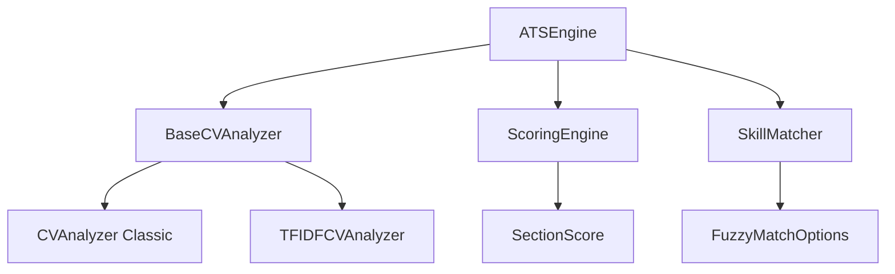

# ATS (Applicant Tracking System) Technical Documentation

## Overview

The ATS system provides comprehensive CV analysis capabilities, including keyword matching, skill assessment, and compatibility scoring against job postings. The system has been refactored to use a modern, extensible architecture with enhanced configurability.

## Table of Contents

- [Architecture Overview](#architecture-overview)
- [Core Components](#core-components)
- [Configuration](#configuration)
- [Usage Examples](#usage-examples)
- [Extension Points](#extension-points)
- [API Reference](#api-reference)

## Architecture Overview

The ATS system is built around a unified architecture with the following key components:



### Key Design Principles

1. **Extensibility**: Abstract base class allows for custom analyzer implementations
2. **Configurability**: All components accept configuration options for customization
3. **Backward Compatibility**: Existing APIs remain unchanged
4. **Performance**: Shared logic reduces duplication and improves efficiency
5. **Type Safety**: Comprehensive TypeScript interfaces ensure reliability

## Core Components

### 1. BaseCVAnalyzer (Abstract Base Class)

The foundation of all CV analyzers, providing shared functionality:

```typescript
export abstract class BaseCVAnalyzer {
  protected readonly stopWords: Set<string>;
  protected readonly options: Required<AnalyzerOptions>;
  
  public abstract analyze(cv: CVData, posting: JobPosting): BaseAnalysisResult;
  protected validateInputs(cv: CVData, posting: JobPosting): BaseAnalysisResult | null;
  protected performKeywordMatching(cvText: string, jobText: string): { matches: string[]; missing: string[] };
  protected calculateComponentScores(cv: CVData, posting: JobPosting): { experienceScore: number; educationScore: number };
}
```

**Features:**
- Input validation and error handling
- Shared text extraction methods
- Common scoring calculations
- Configurable stop words and options

### 2. Analyzer Implementations

#### CVAnalyzer (Classic)
- Traditional keyword-based analysis
- Simple scoring algorithm
- Fast performance
- Suitable for most use cases

#### TFIDFCVAnalyzer
- Advanced TF-IDF-based analysis
- Natural language processing
- Enhanced keyword weighting
- Better accuracy for complex documents

### 3. Enhanced Scoring Engine

```typescript
export class ScoringEngine {
  constructor(criteria?: ScoringCriteria) { }
  
  public score(cv: CVData, posting: JobPosting): CVScore;
  private scoreKeywords(cv: CVData, posting: JobPosting): SectionScore;
  private scoreExperience(cv: CVData, posting: JobPosting): SectionScore;
  private scoreEducation(cv: CVData, posting: JobPosting): SectionScore;
  private scoreSkills(cv: CVData, posting: JobPosting): SectionScore;
}
```

**Features:**
- Customizable scoring weights
- Section-by-section analysis
- Detailed suggestions and feedback
- Fuzzy matching support (planned)

### 4. Skill Matching System

```typescript
export class SkillMatcher {
  constructor(skills?: SkillDefinition[], fuzzyOptions?: FuzzyMatchOptions) { }
  
  public findSkill(name: string): SkillDefinition | undefined;
  public getRelatedSkills(name: string): SkillDefinition[];
  public areRelated(skill1: string, skill2: string): boolean;
}
```

**Features:**
- Comprehensive skill taxonomy
- Alias and related skill support
- Fuzzy matching capabilities
- Extensible skill definitions

## Configuration

### AnalyzerOptions

```typescript
interface AnalyzerOptions {
  keywordWeight?: number;      // Default: 0.5
  experienceWeight?: number;   // Default: 0.3
  educationWeight?: number;    // Default: 0.2
  enableTfIdf?: boolean;       // Default: false
  customStopWords?: string[];  // Default: []
}
```

### ScoringCriteria

```typescript
interface ScoringCriteria {
  keywordWeight?: number;      // Default: 0.3
  experienceWeight?: number;   // Default: 0.3
  educationWeight?: number;    // Default: 0.2
  skillsWeight?: number;       // Default: 0.2
}
```

### FuzzyMatchOptions

```typescript
interface FuzzyMatchOptions {
  enabled?: boolean;          // Default: true
  threshold?: number;         // Default: 0.8 (80% similarity)
}
```

## Usage Examples

### Basic Usage (Classic Analyzer)

```typescript
import { CVAnalyzer } from '@dzb-cv/ats';

// Use the default classic analyzer for fast keyword-based analysis
const analyzer = new CVAnalyzer();
const result = analyzer.analyze(cvData, jobPosting);

console.log(`ATS Score: ${result.score}`);
console.log(`Matched Keywords: ${result.keywordMatches.join(', ')}`);
console.log(`Missing Keywords: ${result.missingKeywords.join(', ')}`);
console.log(`Suggestions: ${result.suggestions.join('\n')}`);
```

### Advanced TF-IDF Analysis

```typescript
import { TFIDFCVAnalyzer } from '@dzb-cv/ats';

// Use TF-IDF analyzer for enhanced accuracy with natural language processing
const analyzer = new TFIDFCVAnalyzer();
const result = analyzer.analyze(cvData, jobPosting);

console.log(`Enhanced Score: ${result.score}`);
console.log(`TF-IDF Weighted Matches: ${result.keywordMatches.length}`);
```

### Custom Analyzer Configuration

```typescript
import { CVAnalyzer } from '@dzb-cv/ats';

// Configure analyzer weights and custom stop words
const options = {
  keywordWeight: 0.6,
  experienceWeight: 0.3,
  educationWeight: 0.1,
  customStopWords: ['company', 'organization', 'team'],
  enableTfIdf: false // Use classic analysis
};

const analyzer = new CVAnalyzer(options);
const result = analyzer.analyze(cvData, jobPosting);
```

### Complete ATS Engine with Scoring and Skills

```typescript
import { createATSEngine, SkillDefinition, SkillCategory } from '@dzb-cv/ats';

// Create comprehensive analysis engine
const atsEngine = createATSEngine({
  scoring: {
    keywordWeight: 0.25,
    skillsWeight: 0.35,
    experienceWeight: 0.25,
    educationWeight: 0.15
  },
  minimumScore: 0.7
});

const analysis = await atsEngine.analyze(cvData, jobPosting);

// Access detailed results
console.log(`Overall Score: ${analysis.score}`);
console.log(`Keywords Score: ${analysis.scoring.keywords.score}`);
console.log(`Skills Score: ${analysis.scoring.skills.score}`);
console.log(`Experience Score: ${analysis.scoring.experience.score}`);
console.log(`Education Score: ${analysis.scoring.education.score}`);

// Get actionable suggestions
console.log('\nOptimization Suggestions:');
analysis.suggestions.forEach(suggestion => {
  console.log(`- ${suggestion}`);
});

// Review missing skills with alternatives
console.log('\nMissing Skills:');
analysis.missingSkills.forEach(({ skill, alternatives }) => {
  console.log(`- ${skill}`);
  if (alternatives?.length) {
    console.log(`  Related skills you have: ${alternatives.map(a => a.name).join(', ')}`);
  }
});
```

### Standalone Scoring Engine

```typescript
import { ScoringEngine } from '@dzb-cv/ats';

// Use just the scoring engine for detailed section analysis
const scorer = new ScoringEngine({
  keywordWeight: 0.3,
  experienceWeight: 0.3,
  educationWeight: 0.2,
  skillsWeight: 0.2
});

const score = scorer.score(cvData, jobPosting);

// Access detailed section scores
console.log('Keyword Analysis:');
console.log(`  Score: ${score.keywords.score}`);
console.log(`  Matches: ${score.keywords.matches.join(', ')}`);
console.log(`  Missing: ${score.keywords.missing.join(', ')}`);

console.log('\nExperience Analysis:');
console.log(`  Score: ${score.experience.score}`);
score.experience.suggestions.forEach(s => console.log(`  Suggestion: ${s}`));
```

### Custom Skill Matching

```typescript
import { SkillMatcher, SkillDefinition, SkillCategory, AllSkills } from '@dzb-cv/ats';

// Add custom skills to the matcher
const customSkills: SkillDefinition[] = [
  {
    name: 'Machine Learning',
    aliases: ['ML', 'AI/ML', 'Artificial Intelligence', 'Deep Learning'],
    category: SkillCategory.Programming,
    related: ['Python', 'TensorFlow', 'PyTorch', 'Scikit-learn']
  },
  {
    name: 'Kubernetes',
    aliases: ['K8s', 'Container Orchestration'],
    category: SkillCategory.DevOps,
    related: ['Docker', 'Container', 'DevOps', 'Cloud']
  }
];

const skillMatcher = new SkillMatcher([...AllSkills, ...customSkills], {
  enabled: true,
  threshold: 0.8 // 80% similarity for fuzzy matching
});

// Find skills and their relationships
const mlSkill = skillMatcher.findSkill('AI/ML');
console.log(`Found: ${mlSkill?.name}`);

const relatedSkills = skillMatcher.getRelatedSkills('Machine Learning');
console.log(`Related skills: ${relatedSkills.map(s => s.name).join(', ')}`);

// Check skill relationships
const areRelated = skillMatcher.areRelated('Python', 'Machine Learning');
console.log(`Python and ML are related: ${areRelated}`);

// Find skills by category
const programmingSkills = skillMatcher.findByCategory(SkillCategory.Programming);
console.log(`Programming skills: ${programmingSkills.map(s => s.name).join(', ')}`);
```

### Requirement Checking

```typescript
import { createATSEngine } from '@dzb-cv/ats';

const atsEngine = createATSEngine({
  minimumScore: 0.75 // 75% minimum match required
});

// Quick requirement check
if (atsEngine.meetsRequirements(cvData, jobPosting)) {
  console.log('✅ CV meets minimum requirements for this position');
  
  // Get full analysis for qualified candidates
  const analysis = await atsEngine.analyze(cvData, jobPosting);
  console.log(`Final score: ${analysis.score}`);
} else {
  console.log('❌ CV does not meet minimum requirements');
  
  // Still analyze to provide improvement suggestions
  const analysis = await atsEngine.analyze(cvData, jobPosting);
  console.log('\nImprovement areas:');
  analysis.suggestions.forEach(s => console.log(`- ${s}`));
}

## Extension Points

### Creating Custom Analyzers

```typescript
import { BaseCVAnalyzer, BaseAnalysisResult, AnalyzerOptions } from '@dzb-cv/ats';
import type { CVData } from '@dzb-cv/types';
import type { JobPosting } from '@dzb-cv/types/job';

// Industry-specific analyzer with custom weighting
export class HealthcareAnalyzer extends BaseCVAnalyzer {
  constructor() {
    super({
      keywordWeight: 0.4,
      experienceWeight: 0.4,
      educationWeight: 0.2,
      customStopWords: ['hospital', 'clinic', 'medical', 'healthcare']
    });
  }

  public analyze(cv: CVData, posting: JobPosting): BaseAnalysisResult {
    // Use base class validation
    const earlyResult = this.validateInputs(cv, posting);
    if (earlyResult) return earlyResult;

    // Extract text using base class methods
    const cvText = this.extractCVText(cv);
    const jobText = this.extractJobText(posting);
    
    // Perform keyword matching with inherited logic
    const { matches, missing } = this.performKeywordMatching(cvText, jobText);
    
    // Calculate component scores
    const { experienceScore, educationScore } = this.calculateComponentScores(cv, posting);
    
    // Add healthcare-specific scoring
    const certificationScore = this.scoreCertifications(cv);
    const complianceScore = this.scoreComplianceKnowledge(cv, posting);
    
    // Custom overall score calculation
    const keywordScore = matches.length / (matches.length + missing.length || 1);
    const baseScore = this.calculateOverallScore(keywordScore, experienceScore, educationScore);
    const healthcareScore = (baseScore * 0.7) + (certificationScore * 0.2) + (complianceScore * 0.1);

    return {
      score: Math.min(1, healthcareScore),
      keywordMatches: matches,
      missingKeywords: missing,
      suggestions: this.generateHealthcareSuggestions(cv, posting, certificationScore),
      formattingIssues: this.checkHealthcareFormatting(cv)
    };
  }

  private scoreCertifications(cv: CVData): number {
    const healthcareCerts = [
      'rn', 'lpn', 'cna', 'md', 'np', 'pa', 'cpr', 'bls', 'acls',
      'registered nurse', 'licensed practical nurse', 'certified nursing assistant'
    ];
    
    const cvText = this.extractCVText(cv).toLowerCase();
    const foundCerts = healthcareCerts.filter(cert => cvText.includes(cert));
    
    return foundCerts.length / Math.max(healthcareCerts.length * 0.3, 1); // Expect 30% of certs
  }

  private scoreComplianceKnowledge(cv: CVData, posting: JobPosting): number {
    const complianceTerms = ['hipaa', 'osha', 'joint commission', 'cms', 'medicaid', 'medicare'];
    const cvText = this.extractCVText(cv).toLowerCase();
    const jobText = this.extractJobText(posting).toLowerCase();
    
    const requiredCompliance = complianceTerms.filter(term => jobText.includes(term));
    if (requiredCompliance.length === 0) return 1; // No compliance requirements
    
    const foundCompliance = requiredCompliance.filter(term => cvText.includes(term));
    return foundCompliance.length / requiredCompliance.length;
  }

  private generateHealthcareSuggestions(cv: CVData, posting: JobPosting, certScore: number): string[] {
    const suggestions: string[] = [];
    
    if (certScore < 0.5) {
      suggestions.push('Consider adding relevant healthcare certifications (CPR, BLS, etc.)');
    }
    
    if (!this.extractCVText(cv).toLowerCase().includes('hipaa')) {
      suggestions.push('Mention HIPAA compliance knowledge if applicable');
    }
    
    if (!cv.personalInfo.professionalTitle?.toLowerCase().includes('nurse') && 
        !cv.personalInfo.professionalTitle?.toLowerCase().includes('medical')) {
      suggestions.push('Consider a healthcare-focused professional title');
    }
    
    return suggestions;
  }

  private checkHealthcareFormatting(cv: CVData): string[] {
    const issues: string[] = [];
    
    // Check for license numbers format
    const cvText = this.extractCVText(cv);
    if (cvText.includes('license') && !/license[\s#]*\d+/i.test(cvText)) {
      issues.push('License numbers should be clearly formatted');
    }
    
    return issues;
  }
}

// Usage of custom analyzer
const healthcareAnalyzer = new HealthcareAnalyzer();
const result = healthcareAnalyzer.analyze(cvData, jobPosting);
```

### Technology-Specific Analyzer

```typescript
export class TechAnalyzer extends BaseCVAnalyzer {
  private techKeywords = new Set([
    'javascript', 'python', 'react', 'node.js', 'aws', 'docker', 'kubernetes',
    'microservices', 'api', 'database', 'ci/cd', 'agile', 'scrum'
  ]);

  constructor() {
    super({
      keywordWeight: 0.5,
      experienceWeight: 0.3,
      educationWeight: 0.1,
      customStopWords: ['software', 'development', 'programming']
    });
  }

  public analyze(cv: CVData, posting: JobPosting): BaseAnalysisResult {
    const earlyResult = this.validateInputs(cv, posting);
    if (earlyResult) return earlyResult;

    const cvText = this.extractCVText(cv).toLowerCase();
    const jobText = this.extractJobText(posting).toLowerCase();
    
    // Enhanced tech keyword matching
    const techMatches = this.findTechMatches(cvText, jobText);
    const { matches, missing } = this.performKeywordMatching(cvText, jobText);
    
    // Add tech-specific matches
    const allMatches = [...new Set([...matches, ...techMatches.found])];
    const allMissing = [...new Set([...missing, ...techMatches.missing])];
    
    const { experienceScore, educationScore } = this.calculateComponentScores(cv, posting);
    const keywordScore = allMatches.length / (allMatches.length + allMissing.length || 1);
    
    return {
      score: this.calculateOverallScore(keywordScore, experienceScore, educationScore),
      keywordMatches: allMatches,
      missingKeywords: allMissing,
      suggestions: this.generateTechSuggestions(cv, posting, techMatches),
      formattingIssues: []
    };
  }

  private findTechMatches(cvText: string, jobText: string): { found: string[], missing: string[] } {
    const jobTechTerms = Array.from(this.techKeywords).filter(term => jobText.includes(term));
    const found = jobTechTerms.filter(term => cvText.includes(term));
    const missing = jobTechTerms.filter(term => !cvText.includes(term));
    
    return { found, missing };
  }

  private generateTechSuggestions(cv: CVData, posting: JobPosting, techMatches: any): string[] {
    const suggestions: string[] = [];
    
    if (techMatches.missing.length > 0) {
      suggestions.push(`Consider adding these technologies: ${techMatches.missing.join(', ')}`);
    }
    
    if (!cvText.includes('github') && !cvText.includes('portfolio')) {
      suggestions.push('Include links to your GitHub profile or portfolio');
    }
    
    return suggestions;
  }
}

### Industry-Specific Skill Taxonomies

```typescript
import { SkillMatcher, SkillDefinition, SkillCategory, AllSkills } from '@dzb-cv/ats';

// Healthcare-specific skills
const HealthcareSkills: SkillDefinition[] = [
  {
    name: 'Patient Care',
    aliases: ['Patient Assessment', 'Clinical Care', 'Bedside Manner'],
    category: SkillCategory.Soft,
    related: ['Communication', 'Empathy', 'Medical Terminology']
  },
  {
    name: 'Electronic Health Records',
    aliases: ['EHR', 'EMR', 'Electronic Medical Records', 'Epic', 'Cerner'],
    category: SkillCategory.Database,
    related: ['Healthcare IT', 'Data Entry', 'HIPAA Compliance']
  },
  {
    name: 'HIPAA Compliance',
    aliases: ['Healthcare Privacy', 'Patient Privacy', 'Medical Confidentiality'],
    category: SkillCategory.Soft,
    related: ['Healthcare Law', 'Data Security', 'Compliance']
  }
];

// Technology-specific skills with detailed relationships
const AdvancedTechSkills: SkillDefinition[] = [
  {
    name: 'Machine Learning',
    aliases: ['ML', 'AI/ML', 'Artificial Intelligence', 'Deep Learning', 'Neural Networks'],
    category: SkillCategory.Programming,
    related: ['Python', 'TensorFlow', 'PyTorch', 'Scikit-learn', 'Data Science', 'Statistics']
  },
  {
    name: 'Kubernetes',
    aliases: ['K8s', 'Container Orchestration', 'K8S'],
    category: SkillCategory.DevOps,
    related: ['Docker', 'Container', 'DevOps', 'Cloud', 'Microservices', 'Helm']
  },
  {
    name: 'Microservices Architecture',
    aliases: ['Microservices', 'Service-Oriented Architecture', 'SOA', 'Distributed Systems'],
    category: SkillCategory.Programming,
    related: ['API Design', 'Docker', 'Kubernetes', 'Event-Driven Architecture']
  },
  {
    name: 'GraphQL',
    aliases: ['Graph Query Language', 'GQL'],
    category: SkillCategory.Programming,
    related: ['API Design', 'React', 'Apollo', 'REST API', 'JavaScript']
  }
];

// Finance/FinTech skills
const FinanceSkills: SkillDefinition[] = [
  {
    name: 'Risk Management',
    aliases: ['Risk Assessment', 'Risk Analysis', 'Financial Risk'],
    category: SkillCategory.Management,
    related: ['Compliance', 'Regulatory', 'Financial Analysis']
  },
  {
    name: 'Blockchain',
    aliases: ['DLT', 'Distributed Ledger', 'Cryptocurrency', 'Smart Contracts'],
    category: SkillCategory.Programming,
    related: ['Web3', 'Ethereum', 'Solidity', 'Cryptography']
  }
];

// Create specialized skill matchers
const healthcareSkillMatcher = new SkillMatcher([
  ...AllSkills,
  ...HealthcareSkills
], {
  enabled: true,
  threshold: 0.85 // Higher threshold for healthcare precision
});

const techSkillMatcher = new SkillMatcher([
  ...AllSkills,
  ...AdvancedTechSkills
], {
  enabled: true,
  threshold: 0.8
});

// Demonstrate advanced skill matching
const mlSkill = techSkillMatcher.findSkill('AI/ML');
console.log(`Found: ${mlSkill?.name}`);
console.log(`Aliases: ${mlSkill?.aliases?.join(', ')}`);

const relatedSkills = techSkillMatcher.getRelatedSkills('Machine Learning');
console.log(`Related: ${relatedSkills.map(s => s.name).join(', ')}`);

// Check skill relationships across domains
const areRelated = techSkillMatcher.areRelated('Python', 'Machine Learning');
console.log(`Python ↔ ML: ${areRelated}`);

// Find skills by category
const programmingSkills = techSkillMatcher.findByCategory(SkillCategory.Programming);
const softSkills = healthcareSkillMatcher.findByCategory(SkillCategory.Soft);

console.log(`Programming skills available: ${programmingSkills.length}`);
console.log(`Healthcare soft skills: ${softSkills.map(s => s.name).join(', ')}`);
```

### Dynamic Skill Matching in ATS Engine

```typescript
import { createATSEngine, SkillDefinition, SkillCategory } from '@dzb-cv/ats';

// Create ATS engine with custom skills for specific industry
function createIndustryATSEngine(industrySkills: SkillDefinition[]) {
  return createATSEngine({
    skills: [...AllSkills, ...industrySkills],
    scoring: {
      keywordWeight: 0.2,
      skillsWeight: 0.4, // Higher weight for skills in specialized roles
      experienceWeight: 0.3,
      educationWeight: 0.1
    },
    minimumScore: 0.65
  });
}

// Usage for different industries
const healthcareATS = createIndustryATSEngine(HealthcareSkills);
const techATS = createIndustryATSEngine(AdvancedTechSkills);
const financeATS = createIndustryATSEngine(FinanceSkills);

// Analyze with industry-specific context
const healthcareAnalysis = await healthcareATS.analyze(cvData, healthcareJobPosting);
const techAnalysis = await techATS.analyze(cvData, techJobPosting);

// Compare results across industries
console.log(`Healthcare match: ${healthcareAnalysis.score}`);
console.log(`Tech match: ${techAnalysis.score}`);

// Review skill gaps with industry context
healthcareAnalysis.missingSkills.forEach(({ skill, alternatives }) => {
  console.log(`Missing healthcare skill: ${skill}`);
  if (alternatives?.length) {
    console.log(`  You have related: ${alternatives.map(a => a.name).join(', ')}`);
  }
});
```

## API Reference

For detailed API documentation, see:
- [API Reference](./API-REFERENCE.md)
- [Configuration Guide](./CONFIGURATION.md)
- [Migration Guide](./MIGRATION.md)

## Performance Considerations

- **Memory Usage**: Base class pattern reduces memory footprint through shared methods
- **Processing Speed**: Classic analyzer is faster for simple use cases; TF-IDF analyzer provides better accuracy for complex documents
- **Scalability**: Configuration options allow tuning for different performance/accuracy trade-offs

## Testing

The ATS system includes comprehensive test coverage:
- Unit tests for all analyzer implementations
- Integration tests for the complete ATS engine
- Performance benchmarks for different configurations
- Edge case handling validation

## Future Enhancements

- Enhanced fuzzy matching algorithms
- Machine learning-based skill extraction
- Industry-specific analyzer variants
- Real-time analysis feedback
- Integration with external ATS systems

---

**Related Documentation:**
- [API Reference](./API-REFERENCE.md)
- [Configuration Guide](./CONFIGURATION.md)
- [Migration Guide](./MIGRATION.md)
- [User Guide](../../user-guide/advanced-usage.md)
