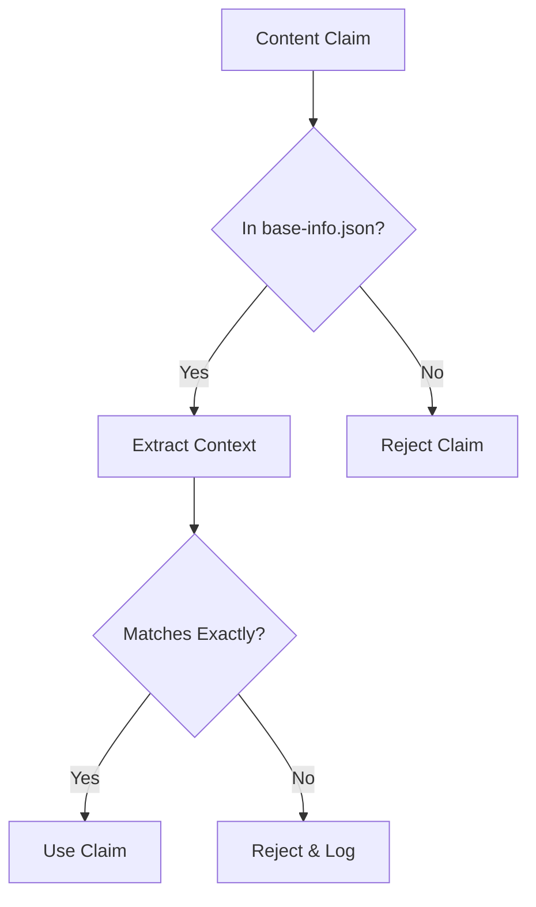

# Data Verification Technical Documentation

## Table of Contents
- [Core Principle](#core-principle)
- [Verification Process](#verification-process)
- [Source Data Structure](#source-data-structure)
- [Verification Rules](#verification-rules)
- [Example Usage](#example-usage-northwestern-medicine-psr)
- [Best Practices](#best-practices)
- [Error Handling](#error-handling)
- [Implementation Notes](#implementation-notes)

## Core Principle

Every claim in generated materials MUST be verifiable against source data in `base-info.json`. No exceptions.

## Verification Process



## Source Data Structure

```typescript
interface SourceData {
  personalInfo: PersonalInfo;
  workExperience: {
    healthcare: Experience[];
    realEstate: Experience[];
    foodIndustry: Experience[];
  };
  skills: {
    technical: string[];
    healthcareAdministration: string[];
    // ... other skill categories
  };
  certifications: Certification[];
}

interface Experience {
  employer: string;
  position: string;
  period: string;
  duties: string[];
  achievements?: string[];
}
```

## Verification Rules

### 1. Experience Claims
```typescript
function verifyExperienceClaim(claim: string): VerificationResult {
  // Must match exactly one of:
  // - A duty from workExperience
  // - An achievement from workExperience
  // No paraphrasing or combining allowed
  return {
    verified: boolean;
    source?: {
      employer: string;
      position: string;
      field: string;
      exact_match: string;
    };
    error?: string;
  };
}
```

### 2. Skills Claims
```typescript
function verifySkillClaim(skill: string): VerificationResult {
  // Must exist exactly in skills categories
  // No implied or derived skills
  return {
    verified: boolean;
    source?: {
      category: string;
      exact_match: string;
    };
    error?: string;
  };
}
```

### 3. Date Verification
```typescript
function verifyDateClaim(claim: {start: string, end: string}): VerificationResult {
  // Must match exactly with source data
  // No date range interpretation
  return {
    verified: boolean;
    source?: Experience;
    error?: string;
  };
}
```

## Example Usage (Northwestern Medicine PSR)

```typescript
// Verifying a specific claim
const claim = "Managed daily patient flow of 60-80 patients";
const verification = await verifyExperienceClaim(claim);

// Success case
{
  verified: true,
  source: {
    employer: "Fox Lake Animal Hospital",
    position: "Front Desk / Veterinary Assistant",
    field: "healthcare",
    exact_match: "Managed patient flow (60-80/day)"
  }
}

// Failure case
{
  verified: false,
  error: "No exact match found in source data"
}
```

## Best Practices

### 1. Exact Matching
- No paraphrasing
- No combining multiple duties
- No inferring skills
- No date interpretation

### 2. Context Preservation
```typescript
interface VerifiedContent {
  content: string;
  verification: {
    source: string;
    context: string;
    timestamp: string;
  };
}
```

### 3. Verification Logging
```typescript
interface VerificationLog {
  timestamp: string;
  claim: string;
  result: VerificationResult;
  context: string;
  agent: string;
}
```

## Error Handling

1. **Unverified Claims**
   ```typescript
   if (!verified) {
     logRejection(claim, "No source data match");
     throw new UnverifiedClaimError(claim);
   }
   ```

2. **Partial Matches**
   ```typescript
   if (partialMatch) {
     logRejection(claim, "Only partial match found");
     suggestExactMatch(claim, partialMatch);
   }
   ```

3. **Context Errors**
   ```typescript
   if (outOfContext) {
     logRejection(claim, "Source data context mismatch");
     suggestProperContext(claim);
   }
   ```

## Implementation Notes

1. **Speed vs Accuracy**
   - Always prioritize accuracy
   - Cache verification results
   - Log all verification attempts

2. **Handling Updates**
   ```typescript
   // When source data updates
   async function handleSourceUpdate() {
     // Re-verify all generated content
     const reverification = await reverifyAllContent();
     // Log any new failures
     logVerificationChanges(reverification);
   }
   ```

3. **Verification Cache**
   ```typescript
   interface VerificationCache {
     claim: string;
     result: VerificationResult;
     timestamp: string;
     sourceVersion: string;
   }
   ```

## Future Improvements

1. **Enhanced Matching**
   - Add fuzzy matching for suggestions only
   - Implement context-aware verification
   - Add source data versioning

2. **Performance**
   - Implement verification indexing
   - Add batch verification
   - Optimize cache strategy

3. **Tooling**
   - Add verification CLI tools
   - Create verification reports
   - Implement verification monitoring
